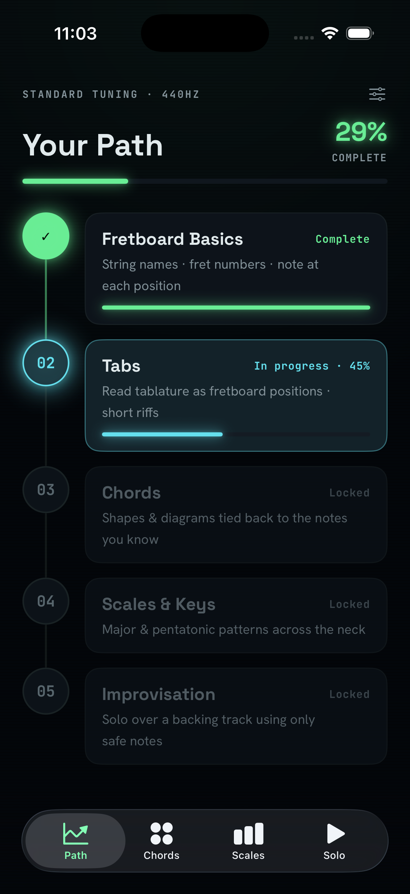
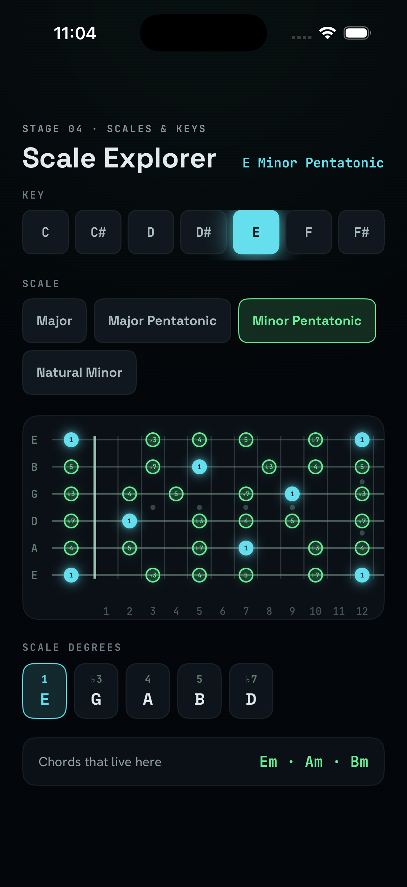
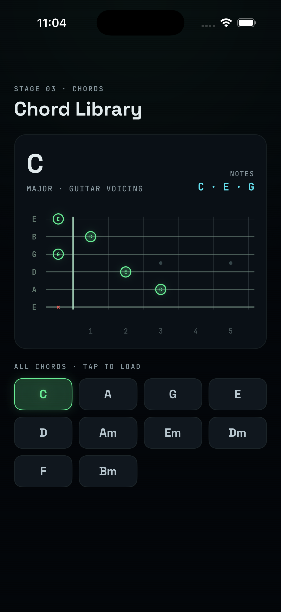

# String Theory

An iOS app that teaches guitar and bass, from naming open strings to improvising in key. It is free: no in-app purchases, no ads, no analytics.

This is a native SwiftUI port of an HTML/JS prototype. The prototype still lives in `prototype/` and is the reference for design and behavior.

<table>
  <tr>
    <td align="center" width="33%"><br/><sub>Home, the Signal Path</sub></td>
    <td align="center" width="33%"><br/><sub>Scale Explorer</sub></td>
    <td align="center" width="33%"><br/><sub>Chord Library</sub></td>
  </tr>
</table>

## Layout

- `StringTheoryCore/` is a Swift package with the music-theory engine and the fretboard geometry. No UIKit or SwiftUI, so it runs under `swift test` on its own.
- `App/StringTheory/` is the iOS app: SwiftUI views, an `@Observable` state model, the design system, and the audio engine.
- `StringTheory.xcodeproj` is committed and opened directly in Xcode. `project.yml` is kept as a record of the original XcodeGen setup.
- `prototype/` holds the original HTML/JS files used as the spec.
- `docs/` has the architecture notes and the App Store checklist.

## Requirements

- Xcode 26 or newer (Swift 6, iOS 17 deployment target).

## Run

```sh
open StringTheory.xcodeproj
```

Pick the StringTheory scheme and an iPhone simulator, then run. To run on a device, see "On your iPhone" below.

## On your iPhone

1. Open `StringTheory.xcodeproj` in Xcode.
2. Select the StringTheory target, then Signing and Capabilities. Check "Automatically manage signing" and pick your team. A free Apple ID works for development.
3. Connect your iPhone, trust the Mac if asked, and choose the phone as the run destination.
4. Run. The first time, approve the developer certificate on the phone under Settings > General > VPN and Device Management.

The bundle id is `com.javierorraca.stringtheory`. Change it in the target's build settings if you need a different one.

## Test

Core package, fast and no simulator:

```sh
swift test --package-path StringTheoryCore
```

App, including the onboarding UI smoke test:

```sh
xcodebuild test \
  -project StringTheory.xcodeproj \
  -scheme StringTheory \
  -destination 'platform=iOS Simulator,name=iPhone 16'
```

CI runs both on every pull request. See `.github/workflows/ci.yml`.

## Architecture

The full version is in `docs/Architecture.md`. The short version: the core package holds everything testable and platform free (notes, tunings, scales, chords, the riff, backing progressions, and the fretboard layout math). The app depends on the core and adds the SwiftUI screens, the shared state model, and an `AVAudioEngine` synth. One fretboard view renders every diagram from the core geometry.

## Screens

Onboarding (instrument and handedness), Home (the five-stage Signal Path), Lesson (fretboard locked to a tab staff), Chord Library, Scale Explorer, and Solo Practice. A Settings sheet changes instrument and handedness after onboarding.

## Shipping

The app collects no data. The privacy manifest is at `App/StringTheory/Resources/PrivacyInfo.xcprivacy`, and the release checklist is in `docs/AppStoreReadiness.md`. The app icon is a generated placeholder; you can regenerate it with `swift tools/make-app-icon.swift <path>`.
